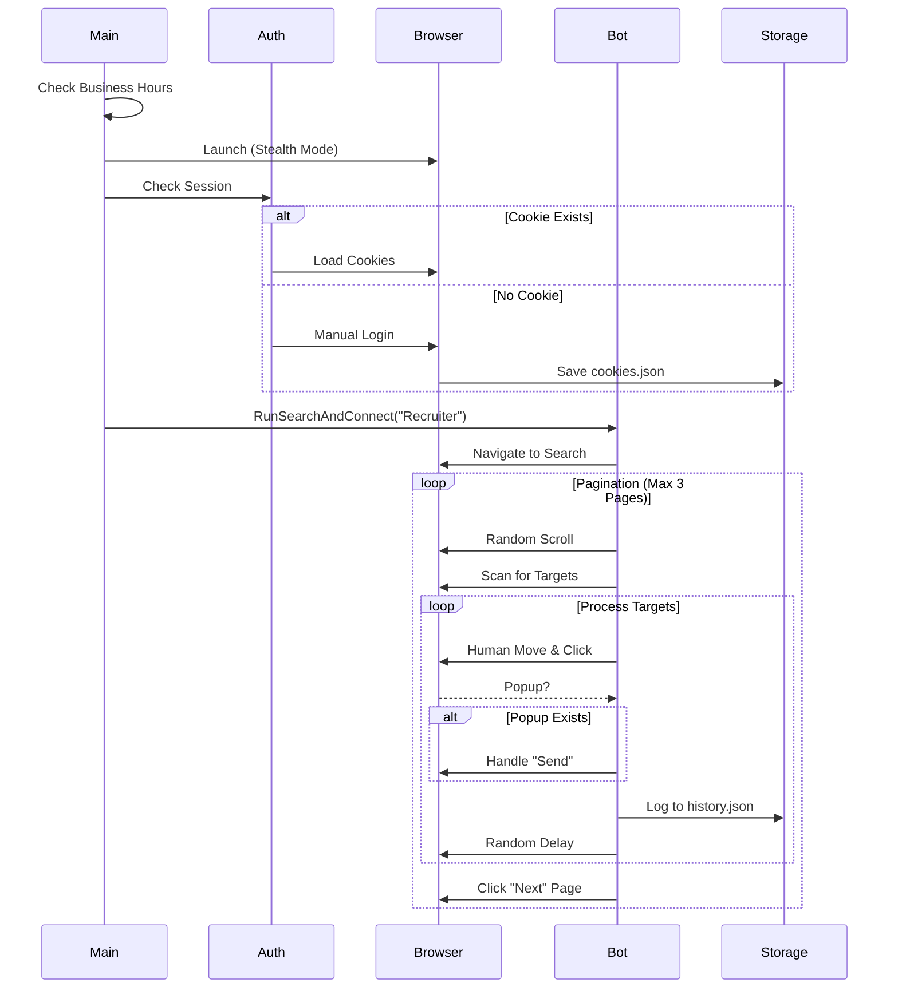

# GoRod LinkedIn Automator (Stealth PoC) 🤖


A sophisticated **Proof-of-Concept (PoC)** for automating LinkedIn interactions using **Go (Golang)** and the **Rod** browser automation library. This project demonstrates advanced "stealth" techniques, modular software architecture, and state persistence patterns.

> **⚠️ CRITICAL DISCLAIMER**
>
> This software is for **Educational Purposes Only**. Automating LinkedIn violates their [User Agreement](https://www.linkedin.com/legal/user-agreement). This tool was built to demonstrate technical proficiency in browser automation and anti-bot detection. **Do not use this on your primary account.** The author accepts no responsibility for account restrictions or bans.

---

## 📺 Demonstration Video

**[👉 CLICK HERE TO WATCH THE DEMO VIDEO](https://drive.google.com/file/d/1wi1oWyA7BDsmUKEeYnqXkmSPSZd4Ivct/view?usp=sharing)**

_The video demonstrates:_

1.  _Stealth Login & Session Persistence_
2.  _Smart Search & Pagination_
3.  _Popup Handling & Data Logging_
4.  Cookie Saving

---

## 🚀 Features

### 🛡️ Anti-Detection Strategy (Stealth)

This tool implements **8+ distinct techniques** to mimic human behavior and evade detection:

1.  **Human-like Mouse Movement:** Uses Bézier curves and micro-corrections (no straight-line robot movements).
2.  **Randomized Timing:** Variable "think time" between every action (e.g., 500ms–1500ms delays).
3.  **Browser Fingerprinting:** Masks `navigator.webdriver` signals using `go-rod/stealth`.
4.  **Realistic Typing:** Types character-by-character with random keystroke delays and pauses.
5.  **Activity Scheduling:** Strict operation window (9 AM – 6 PM, Mon-Fri only).
6.  **Random Scrolling:** Scrolls with variable steps and pauses before scanning results.
7.  **Visual Hovering:** Moves the mouse to "hover" over elements before clicking.
8.  **Rate Limiting:** Enforces strict pagination limits (Max 3 pages) and invite caps (2 per page).

### ⚙️ Core Functionality

-   **Authentication:** Supports environment-based login and **Session Persistence** via cookies (`cookies.json`) to avoid repeated logins.
-   **Search & Targeting:** Navigates search results, handles pagination, and detects "Connect" vs "Follow" buttons via fuzzy logic.
-   **Smart Popup Handling:** Automatically handles "Send without a note" and generic "Send" modals without crashing.
-   **State Persistence:** Logs all successful invites to `history.json` to track activity.
-   **Observability:** Structured logging (`slog`) output to standard terminal for real-time monitoring.

---

## 🏗️ Architecture

The project follows a clean, modular Go architecture to ensure maintainability and separation of concerns.



## Directory Structure

-   cmd/bot: Entry point (main.go).

-   internal/actions: Human simulation logic (Mouse, Typing).

-   internal/auth: Login logic and Cookie management.

-   internal/bot: Core business logic (Search workflow).

-   internal/browser: Rod setup and Stealth injection.

-   pkg/config: Environment variable management.

-   pkg/storage: JSON file persistence (history.json).

-   pkg/utils: Randomization helpers.

## 🛠️ Installation & Setup

**Prerequisites**

-   Go 1.21+ installed.

-   Google Chrome installed.

**1. Clone the Repository**

```bash
git clone https://github.com/chamollamohit/LinkedIn-Automator.git
cd linkedin-automation
```

**2. Configure Environment**
Create a `.env` file in the root directory:

```bash
cp .env.example .env
Edit .env with your Bot Account credentials:
```

```
LINKEDIN_EMAIL=your_bot_email@gmail.com
LINKEDIN_PASSWORD=your_secure_password
```

(Note: Use a direct password. "Login with Google" is not supported.)

**3. Install Dependencies**

```bash
go mod tidy
```

**▶️ Usage**
Run the bot directly from the terminal:

```bash
go run cmd/bot/main.go
```

**First Run:**

1. The bot will launch a visible Chrome window.

2. It will log in using your credentials.

3. **If a Captcha appears:** You must solve it manually within the window.

4. Once on the feed, it saves cookies.json and begins the search workflow.

**Subsequent Runs:**

The bot loads cookies.json and skips login (Simulating a saved session).

## 📝 Configuration (Stealth)

You can adjust stealth parameters in `pkg/utils/random.go` and `internal/bot/workflow.go`:

### Configuration Settings

| Setting Name        | Value            | Description                                                                        |
| :------------------ | :--------------- | :--------------------------------------------------------------------------------- |
| **RandomSleep**     | `500ms - 1500ms` | The random delay interval between standard actions to mimic human behavior.        |
| **limitPerPage**    | `2`              | The maximum number of invites to send per search results page.                     |
| **maxPages**        | `3`              | The maximum number of search pages the script will traverse in a single run.       |
| **isBusinessHours** | `9 AM - 6 PM`    | The time window during which the script is allowed to run (enforced in `main.go`). |

## ⚠️ Limitations & Known Issues

**1. Messaging System Omission:**

-   **Reason**: The assignment requirements included a "Messaging System" (follow-ups). This module was architected (internal/messaging) but disabled for this submission.

-   **Context**: LinkedIn applies extremely strict rate limits to new accounts sending messages. Enabling this feature immediately triggers account restrictions, making the PoC untestable. The Connection workflow demonstrates the same underlying automation principles safely.

**2. Duplicate Detection:**

-   The bot logs to history.json but currently does not cross-reference this file during the search loop. This was a design choice to keep the search loop performance high for the demo.

## 🔮 Future Roadmap

-   Implement SQLite for robust relational data storage.

-   Add OpenAI API integration to generate personalized connection notes.

-   Implement Headless Mode toggle for server deployment.

-   Add Proxy Support to rotate IP addresses for higher scale.
